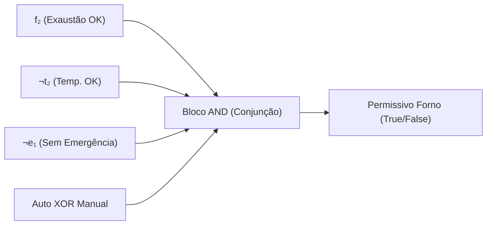

# Aula 04: Lógica Proposicional — Conectivos e Blocos de Permissivos

## 1. Fundamentos Matemáticos: Conectivos Lógicos

Na matemática discreta, uma proposição é uma sentença declarativa que assume um e apenas um valor-verdade: Verdadeiro ($1$) ou Falso ($0$).

As operações sobre variáveis proposicionais são definidas por operadores lógicos:

* **Negação ($\neg A$):** Inverte o valor-verdade.
* **Conjunção ($A \land B$):** Verdadeira se ambos os operandos forem verdadeiros. Modela condições em série.
* **Disjunção ($A \lor B$):** Verdadeira se ao menos um dos operandos for verdadeiro. Modela falhas em paralelo.
* **Disjunção Exclusiva ($A \oplus B$):** Verdadeira se exatamente um dos operandos for verdadeiro. Usada em seletores de modo.

## 2. Aplicação em Engenharia: Permissivos de Partida

Um permissivo de partida (*Start Permissive*) é uma condição booleana que deve ser estritamente satisfeita para que um atuador receba o comando.

### 2.1. Permissivo do Forno de Torra ($P_{\text{Forno}}$)

O acionamento do queimador do forno requer:

* Exaustão de ar operante: $f_2$
* Temperatura inicial segura: $\neg t_2$
* Ausência de botão de emergência: $\neg e_1$
* Modo operacional definido: $\text{Auto} \oplus \text{Manual}$

$$P_{\text{Forno}} \equiv f_2 \land \neg t_2 \land \neg e_1 \land (\text{Auto} \oplus \text{Manual})$$

### 2.2. Intertrava de Bloqueio Contínuo (*Run Interlock*)

Mesmo após a partida, se qualquer condição crítica falhar, a operação é interrompida.

$$
\text{Trip}_{\text{Forno}} \equiv \neg f_2 \lor t_2 \lor e_1
$$

Pelas Leis de De Morgan:

$$
\text{Trip}*{\text{Forno}} \equiv \neg P*{\text{Forno-base}}
$$

    
