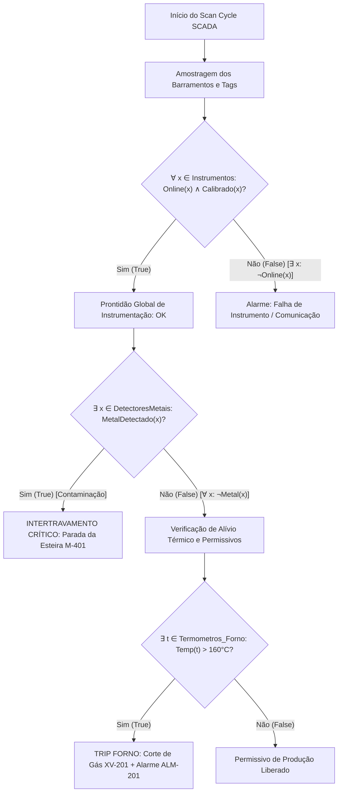

# Aula 06: Lógica de Predicados, Quantificadores e Varredura Global de Sensores

## 1. Fundamentos Matemáticos: Lógica de Predicados e Quantificadores

Nas etapas iniciais do projeto (Aulas 02 a 05), as condições de segurança e intertravamento foram tratadas através da **Lógica Proposicional**, na qual cada sinal de sensor ou atuador é discretizado em uma variável booleana fixa ($0$ ou $1$).

Contudo, uma planta industrial agroalimentícia automatizada — como a linha de fabricação contínua de paçoca — possui dezenas de instrumentos distribuídos entre recepção, torra, moagem, prensagem e embalagem. Tratar cada sensor individualmente em equações estáticas torna o software supervisório rígido, não escalável e sujeito a erros na manutenção de código.

Para superar essa limitação, emprega-se a **Lógica de Primeira Ordem (LPO)** ou **Lógica de Predicados**.

### 1.1. Universo de Discurso e Predicados

* **Universo de Discurso ($\mathcal{U}$):** Conjunto de todos os elementos sob supervisão. Na arquitetura proposta, $\mathcal{U}$ pode ser o conjunto de todos os instrumentos ($\mathcal{I}$), setores de controle ($\mathcal{S}$), atuadores/válvulas ($\mathcal{V}$) ou motores/acionamentos ($\mathcal{M}$).

* **Predicado $P(x)$:** Função proposicional parametrizada que mapeia um elemento $x \in \mathcal{U}$ em um valor-verdade $\{\text{Verdadeiro}, \text{Falso}\}$.

  * Exemplo: $\text{IsOnline}(x) \in \{0, 1\}$ indica se o instrumento $x$ está comunicando ativamente na rede industrial (Profinet/Modbus TCP).

  * Exemplo: $\text{IsCalibrado}(x) \in \{0, 1\}$ indica se o instrumento $x$ está com laudo metrológico válido.

  * Exemplo: $\text{SobreTemp}(x, T_{\text{max}}) \in \{0, 1\}$ indica se o termômetro $x$ superou o limite seguro.

### 1.2. Quantificador Universal ($\forall$)

O quantificador universal estabelece que uma propriedade lógica é satisfeita por **todos** os elementos do universo de discurso:

$$
\forall x \in \mathcal{U}, P(x)
$$

Em um domínio finito de instrumentos $\mathcal{U} = \{i_1, i_2, \dots, i_n\}$, a quantificação universal equivale à **conjunção generalizada**:

$$
\forall x \in \mathcal{U}, P(x)
\iff
P(i_1) \land P(i_2) \land \dots \land P(i_n)
$$

* **Critério de Curto-Circuito (Falsidade):** Basta a ocorrência de um único elemento $k \in \mathcal{U}$ tal que $P(k) = \text{Falso}$ (denominado **contraexemplo**) para invalidar imediatamente toda a proposição $\forall x P(x)$.

### 1.3. Quantificador Existencial ($\exists$)

O quantificador existencial expressa que uma propriedade é satisfeita por **pelo menos um** elemento do domínio:

$$
\exists x \in \mathcal{U}, Q(x)
$$

Para um universo finito $\mathcal{U} = \{i_1, i_2, \dots, i_n\}$, a quantificação existencial equivale à **disjunção generalizada**:

$$
\exists x \in \mathcal{U}, Q(x)
\iff
Q(i_1) \lor Q(i_2) \lor \dots \lor Q(i_n)
$$

* **Critério de Curto-Circuito (Veracidade):** Basta identificar uma única **testemunha** (*witness*) $k \in \mathcal{U}$ tal que $Q(k) = \text{Verdadeiro}$ para validar imediatamente a proposição $\exists x Q(x)$.

### 1.4. Quantificação sobre Subdomínios Restritos (Predicado Guardião)

Na engenharia de automação, comumente quantifica-se apenas sobre uma classe restrita de instrumentos, por exemplo, apenas transmissores de temperatura do Forno de Torra ou apenas detectores de metais.

1. **Universal com Domínio Restrito (Exige Implicação $\rightarrow$):**

$$
\forall x \in \mathcal{S}, P(x)
\iff
\forall x (\text{PertenceAoSetor}(x, \mathcal{S}) \rightarrow P(x))
$$

2. **Existencial com Domínio Restrito (Exige Conjunção $\land$):**

$$
\exists x \in \mathcal{S}, Q(x)
\iff
\exists x (\text{PertenceAoSetor}(x, \mathcal{S}) \land Q(x))
$$

> **IMPORTANT**
>
> A implicação lógica ($\rightarrow$) é indispensável no quantificador universal para assegurar que elementos fora do subconjunto não falseiem a avaliação por vacuidade:
>
> $$
> F \rightarrow P(x) \equiv V
> $$
>
> No existencial, a conjunção ($\land$) garante que a testemunha de fato pertença ao subdomínio alvo.

### 1.5. Leis de De Morgan para Quantificadores (Dualidade Lógica)

A negação formal de quantificadores é o fundamento matemático para a engenharia de segurança *Fail-Safe* e síntese de alarmes:

$$
\neg (\forall x P(x)) \equiv \exists x (\neg P(x))
$$

$$
\neg (\exists x Q(x)) \equiv \forall x (\neg Q(x))
$$

**Interpretação na Fábrica de Paçoca:**

* *"Não é verdade que todos os instrumentos estão calibrados e comunicando"* $\iff$ *"Existe ao menos um instrumento offline ou descalibrado"*.

* *"Não existe contaminação metálica ou produto quebrado na linha"* $\iff$ *"Todos os sensores de qualidade atestam produto conforme"*.

---

## 2. Aplicação em Engenharia: Motor de Varredura Global (SCADA-Core)

No ciclo de varredura (*scan cycle*) do SCADA-Core, o motor de diagnóstico supervisiona periodicamente o ecossistema de instrumentos da planta de paçoca.

---

## 3. Modelagem de Predicados da Fábrica de Paçoca (Grupo 7)

Conforme o mapeamento formal de variáveis definido no catálogo ISA-5.1 da fábrica (Setores 100, 200, 300 e 400):

### 3.1. Tabela de Predicados Operacionais

| **Predicado** | **Notação** | **Descrição Física no Processo** |
|---|---|---|
| $\text{IsOnline}(x)$ | $O(x)$ | O instrumento $x$ responde no barramento de campo sem timeout |
| $\text{IsCalibrado}(x)$ | $C(x)$ | O instrumento $x$ está dentro da validade de calibração metrológica |
| $\text{IsSaudavel}(x)$ | $S(x)$ | $O(x) \land C(x)$ (Integridade completa do canal de sinal) |
| $\text{IsSobretemperatura}(x)$ | $T_{\text{hi}}(x)$ | O transmissor de temperatura $x \in \mathcal{T}$ reporta $T > T_{\text{max}}$ (ex: Forno $> 160^\circ\text{C}$) |
| $\text{IsMetalDetectado}(x)$ | $D_{\text{met}}(x)$ | O detector $x \in \mathcal{D}_{\text{met}}$ detecta fragmento ferroso/não-ferroso |
| $\text{IsDefeitoOptico}(x)$ | $I_{\text{vis}}(x)$ | A câmera de IA $x \in \mathcal{V}_{\text{vis}}$ detecta paçoca quebrada ou coloração anômala |
| $\text{IsPressaoArOK}(x)$ | $P_{\text{air}}(x)$ | O pressostato $x \in \mathcal{P}$ mede pressão da rede pneumática $> 6\text{ bar}$ |
| $\text{IsValvulaAberta}(x)$ | $V_{\text{op}}(x)$ | A válvula $x \in \mathcal{V}$ confirma sensor de fim de curso em estado ABERTA |
| $\text{IsMotorLigado}(x)$ | $M_{\text{on}}(x)$ | O contator/inversor do motor $x \in \mathcal{M}$ reporta confirmação de giro |
| $\text{IsEmergenciaAtiva}(x)$ | $E_{\text{act}}(x)$ | O botão de emergência físico $x \in \mathcal{E}$ está pressionado |

### 3.2. Equações Lógicas Globais de Supervisão

1. **Prontidão Geral da Planta para Partida ($\text{PlantReadiness}$):**

$$
\text{PlantReadiness}
\iff
(\forall x \in \mathcal{I}, \text{IsSaudavel}(x))
\land
(\neg \exists e \in \mathcal{E}, \text{IsEmergenciaAtiva}(e))
$$

2. **Intertrava Crítica de Segurança Alimentar ($\text{QualityTrip}$):**

$$
\text{QualityTrip}
\iff
(\exists d \in \mathcal{D}_{\text{met}}, \text{IsMetalDetectado}(d))
\lor
(\exists v \in \mathcal{V}_{\text{vis}}, \text{IsDefeitoOptico}(v))
$$

3. **Intertravamento de Alívio Térmico do Forno de Torra ($\text{ThermalTrip}_{\text{Forno}}$):**

$$
\text{ThermalTrip}_{\text{Forno}}
\iff
\exists t \in \mathcal{T}_{\text{Forno}},
\text{IsSobretemperatura}(t)
$$

4. **Permissivo de Rota e Embalagem ($\text{Perm}_{\text{Embalagem}}$):**

$$
\text{Perm}_{\text{Embalagem}}
\iff
(\forall p \in \mathcal{P}_{\text{Pneum}}, \text{IsPressaoArOK}(p))
\land
(\forall v \in \mathcal{V}_{\text{Linha}}, \text{IsValvulaAberta}(v))
\land
(\exists m \in \mathcal{M}_{\text{Esteiras}}, \text{IsMotorLigado}(m))
$$
