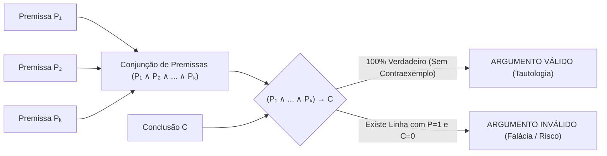
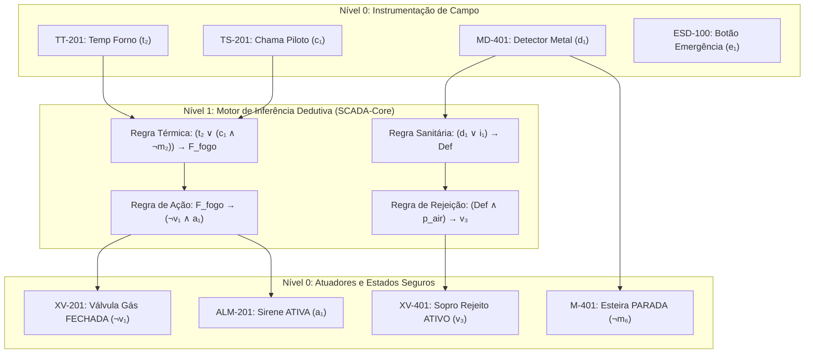

# Aula 07: Validade, Inferência Lógica e Prova de Ausência de Falhas — Fábrica de Paçoca

---
## 1. Fundamentos Matemáticos: Teoria da Validade e Inferência Lógica
Na matemática discreta e na lógica matemática aplicada à automação de sistemas críticos, um **argumento dedutivo** é uma estrutura relacional finita composta por um conjunto de proposições denominadas **premissas** $\{P_1, P_2, \dots, P_k\}$ e uma proposição terminal denominada **conclusão** $C$, formalizada pela notação em sequente:
$$P_1, P_2, \dots, P_k \vdash C$$
---
### 1.1. Definição Formal de Validade e Tautologia de Inferência
Um argumento é **formalmente válido** ($\models$) se e somente se é logicamente impossível que todas as premissas sejam simultaneamente verdadeiras ($1$) e a conclusão seja falsa ($0$). 
No cálculo proposicional clássico, isso equivale a enunciar que o **condicional correspondente** é uma **TAUTOLOGIA** (verdadeiro para todas as $2^n$ valorações de variáveis):
$$\text{Validade}(P_1, P_2, \dots, P_k \vdash C) \iff (P_1 \land P_2 \land \dots \land P_k) \rightarrow C \equiv \mathbf{1} \quad (\text{Tautologia})$$

#### Critério de Invalidez (Contraexemplo Operacional):
Um argumento é **inválido** se e somente se existe pelo menos um estado de processo (*valoração*) tal que:
$$v(P_1) = 1, \quad v(P_2) = 1, \quad \dots, \quad v(P_k) = 1 \quad \text{e} \quad v(C) = 0$$
Em automação industrial, esse contraexemplo representa uma **falha silenciosa de segurança**: a planta atende a todas as condições nominais assumidas pelo operador, mas o sistema executa uma ação incorreta ou perigosa.
---
### 1.2. Regras Clássicas de Inferência Dedutiva
As regras de inferência são esquemas sintáticos tautológicos que preservam o valor-verdade, permitindo ao motor supervisório (*SCADA Inference Engine*) deduzir ações de controle em tempo real sem a necessidade de recomputar a tabela-verdade completa:
| Regra de Inferência | Notação Sequente | Forma Proposicional Associada | Interpretação Física em Automação |
| :--- | :--- | :--- | :--- |
| **Modus Ponens (MP)** | $P \rightarrow Q, P \vdash Q$ | $((P \rightarrow Q) \land P) \rightarrow Q$ | Ativação determinística de intertravamento de segurança |
| **Modus Tollens (MT)** | $P \rightarrow Q, \neg Q \vdash \neg P$ | $((P \rightarrow Q) \land \neg Q) \rightarrow \neg P$ | Diagnóstico retroativo de causa-raiz por sensor inativo |
| **Silogismo Hipotético (SH)** | $P \rightarrow Q, Q \rightarrow R \vdash P \rightarrow R$ | $((P \rightarrow Q) \land (Q \rightarrow R)) \rightarrow (P \rightarrow R)$ | Encadeamento hierárquico de proteções em cascata |
| **Silogismo Disjuntivo (SD)** | $P \lor Q, \neg P \vdash Q$ | $((P \lor Q) \land \neg P) \rightarrow Q$ | Chaveamento automático para rota redundante de processo |
| **Regra da Resolução** | $P \lor Q, \neg P \lor R \vdash Q \lor R$ | $((P \lor Q) \land (\neg P \lor R)) \rightarrow (Q \lor R)$ | Motor de inferência SAT e resolução de cláusulas FNC |
| **Dilema Construtivo (DC)** | $P \rightarrow Q, R \rightarrow S, P \lor R \vdash Q \lor S$ | $((P \rightarrow Q) \land (R \rightarrow S) \land (P \lor R)) \rightarrow (Q \lor S)$ | Supervisão simultânea de falhas em múltiplos setores |
| **Simplificação Conjuntiva** | $P \land Q \vdash P$ | $(P \land Q) \rightarrow P$ | Isolamento de variável crítica a partir de vetor de alarmes |
| **Adição Disjuntiva** | $P \vdash P \lor Q$ | $P \rightarrow (P \lor Q)$ | Generalização de gatilho para matrizes de alarme |
| **Redução ao Absurdo (RAA)** | Se $(P_1 \land \dots \land P_k \land \neg C) \equiv 0$, então $P_1, \dots, P_k \vdash C$ | Prova formal de impossibilidade de colisão e risco |
---
### 1.3. Falácias Formais Comuns em Projetos de Automação
No projeto de sistemas de supervisão, duas falácias lógicas são frequentes fontes de acidentes industriais:
1. **Afirmação do Consequente (Falácia):**
   $$P \rightarrow Q, Q \not\vdash P$$
   *Exemplo Industrial:* *"Se a receita foi dosada corretamente ($P$), o nível do silo de mistura atinge o alvo ($Q$). O nível atingiu o alvo ($Q$), logo todos os ingredientes (açúcar, sal, amendoim) foram dosados na proporção exata ($P$)."*  
   *Erro de Engenharia:* O silo pode ter atingido o nível apenas com amendoim devido a entupimento das válvulas de açúcar e sal. Assumir $P$ gera batelada estragada.
   **Negação do Antecedente (Falácia):**
   $$P \rightarrow Q, \neg P \not\vdash \neg Q$$
   *Exemplo Industrial:* *"Se o botão de emergência for pressionado ($P$), desligue o motor do moinho ($Q$). A emergência não foi pressionada ($\neg P$), logo mantenha o motor ligado ($Q$)."*  
   *Erro de Engenharia:* O motor pode precisar ser desligado por sobretemperatura, sobrecarga térmica ou fim de batelada.
---

## 2. Engenharia de Controle & Automação: Prova de Ausência de Falhas (*Fault-Free Proof*)
Em sistemas industriais regidos pelas normas **IEC 61508 / IEC 61511 (Segurança Funcional / SIL)** e **ISO 13849 (Performance Level)**, a integridade da lógica de controle deve ser formalmente verificada.

### Princípios da Arquitetura Segura (*Fail-Safe Dominance*):
1. **Completude e Determinismo:** Cada cenário de risco mapeado ativa uma cadeia dedutiva que culmina no estado seguro (*Fail-Safe State*).
2. **Consistência e Não-Ambiguidade:** É impossível que as regras de controle deduzam simultaneamente ordens conflitantes para o mesmo atuador ($Actuator = 1$ e $Actuator = 0$).
3. **Prova por Redução ao Absurdo:** Demonstra-se que o estado de perigo simultâneo à ativação da proteção gera uma **Contradição Absoluta** ($0$).
---
## 3. Modelagem Formal das Cadeias de Inferência da Fábrica de Paçoca
Mapeamos as regras de operação e proteção baseadas nas tags ISA-5.1 da planta:
### 3.1. Caso 1: Intertravamento Térmico do Forno de Torra (Setor 200 — CLP 02)
* **Variáveis de Processo:**
  * $t_2$: Temperatura do Forno excede $160^\circ\text{C}$ (`TT-201`)
  * $c_1$: Chama do queimador detectada (`TS-201`)
  * $m_2$: Esteira do forno ligada (`M-201`)
  * $F_{fogo}$: Flag de risco iminente de queima/incêndio
  * $v_1$: Válvula de gás combustível aberta (`XV-201`)
  * $a_1$: Alarme audiovisual de torra ativado (`ALM-201`)
* **Argumento Formal:**
  $$\begin{aligned}
  P_1 &: (t_2 \lor (c_1 \land \neg m_2)) \rightarrow F_{fogo} \quad &\text{(Regra de Risco Térmico)} \\
  P_2 &: F_{fogo} \rightarrow (\neg v_1 \land a_1) \quad &\text{(Regra de Atuação de Emergência)} \\
  P_3 &: t_2 \quad &\text{(Fato: Sensor TT-201 acusa sobretemperatura)} \\
  \hline
  \therefore C_1 &: \neg v_1 \quad &\text{(Conclusão: Válvula de Gás Cortada)}
  \end{aligned}$$
  
#### Demonstração Dedutiva Passo a Passo:
1. $t_2$ (de $P_3$, Fato de Campo).
2. $t_2 \lor (c_1 \land \neg m_2)$ (por Adição Disjuntiva em 1).
3. $F_{fogo}$ (por **Modus Ponens** aplicado em 2 e $P_1$).
4. $\neg v_1 \land a_1$ (por **Modus Ponens** aplicado em 3 e $P_2$).
5. $\mathbf{\neg v_1}$ (por **Simplificação Conjuntiva** em 4). $\blacksquare$
---
### 3.2. Caso 2: Proteção de Qualidade e Segurança Alimentar (Setor 400 — CLP 04)
* **Variáveis de Processo:**
  * $d_1$: Fragmento metálico detectado (`MD-401`)
  * $i_1$: Paçoca quebrada / defeito óptico detectado (`VS-401`)
  * $Def$: Lote com produto não-conforme
  * $p_{air}$: Pressão da rede pneumática nominal ($> 6\text{ bar}$) (`PS-402`)
  * $v_3$: Válvula de ar comprimido de rejeição aberta (`XV-401`)
  * $m_6$: Esteira de embalagem ligada (`M-401`)
  * **Argumento Formal:**
  $$\begin{aligned}
  P_1 &: (d_1 \lor i_1) \rightarrow Def \quad &\text{(Critério de Rejeição)} \\
  P_2 &: (Def \land p_{air}) \rightarrow v_3 \quad &\text{(Comando de Sopro Pneumático)} \\
  P_3 &: d_1 \rightarrow \neg m_6 \quad &\text{(Intertravamento Crítico por Contaminação)} \\
  P_4 &: d_1 \land p_{air} \quad &\text{(Fato: Metal detectado e Pressão Pneumática OK)} \\
  \hline
  \therefore C_2 &: v_3 \land \neg m_6 \quad &\text{(Conclusão: Ejeção Ativa e Esteira Bloqueada)}
  \end{aligned}$$
#### Demonstração Dedutiva Passo a Passo:
1. $d_1$ (por Simplificação Conjuntiva em $P_4$).
2. $p_{air}$ (por Simplificação Conjuntiva em $P_4$).
3. $d_1 \lor i_1$ (por Adição Disjuntiva em 1).
4. $Def$ (por **Modus Ponens** em 3 e $P_1$).
5. $Def \land p_{air}$ (por Conjunção entre 4 e 2).
6. $v_3$ (por **Modus Ponens** em 5 e $P_2$).
7. $\neg m_6$ (por **Modus Ponens** em 1 e $P_3$).
8. $\mathbf{v_3 \land \neg m_6}$ (por Conjunção entre 6 e 7). $\blacksquare$
---
* **Argumento Formal:**
  $$\begin{aligned}
  P_1 &: (d_1 \lor i_1) \rightarrow Def \quad &\text{(Critério de Rejeição)} \\
  P_2 &: (Def \land p_{air}) \rightarrow v_3 \quad &\text{(Comando de Sopro Pneumático)} \\
  P_3 &: d_1 \rightarrow \neg m_6 \quad &\text{(Intertravamento Crítico por Contaminação)} \\
  P_4 &: d_1 \land p_{air} \quad &\text{(Fato: Metal detectado e Pressão Pneumática OK)} \\
  \hline
  \therefore C_2 &: v_3 \land \neg m_6 \quad &\text{(Conclusão: Ejeção Ativa e Esteira Bloqueada)}
  \end{aligned}$$
#### Demonstração Dedutiva Passo a Passo:
1. $d_1$ (por Simplificação Conjuntiva em $P_4$).
2. $p_{air}$ (por Simplificação Conjuntiva em $P_4$).
3. $d_1 \lor i_1$ (por Adição Disjuntiva em 1).
4. $Def$ (por **Modus Ponens** em 3 e $P_1$).
5. $Def \land p_{air}$ (por Conjunção entre 4 e 2).
6. $v_3$ (por **Modus Ponens** em 5 e $P_2$).
7. $\neg m_6$ (por **Modus Ponens** em 1 e $P_3$).
8. $\mathbf{v_3 \land \neg m_6}$ (por Conjunção entre 6 e 7). $\blacksquare$
---
### 3.3. Caso 3: Prova por Redução ao Absurdo (RAA) da Parada de Emergência (`ESD-100`)
Provamos matematicamente que o motor da peneira de grãos (`M-101` / $m_1$) **não pode** permanecer ligado quando o botão de emergência (`ESD-100` / $e_1$) é acionado sob a regra de intertravamento:
* **Regra de Intertravamento:** $e_1 \rightarrow \neg m_1$
* **Hipótese de Violação (Tentativa de Contradição):** Assumir que $e_1 = 1$ e $m_1 = 1$ simultaneamente com a regra operante.
* **Formulação da Conjunção Crítica:**
  $$\Phi = (e_1 \rightarrow \neg m_1) \land e_1 \land m_1$$
* **Expansão e Resolução Booleana:**
  $$\begin{aligned}
  \Phi &\equiv (\neg e_1 \lor \neg m_1) \land e_1 \land m_1 \\
  &\equiv ((\neg e_1 \land e_1 \land m_1) \lor (\neg m_1 \land e_1 \land m_1)) \\
  &\equiv (0 \land m_1) \lor (0 \land e_1) \\
  &\equiv 0 \lor 0 \equiv \mathbf{0} \quad (\textbf{CONTRADIÇÃO COMPROVADA})
  \end{aligned}$$
* **Conclusão de Engenharia:** Como a violação é uma contradição matemática ($\Phi \equiv 0$), o estado inseguro é inalcançável sob execução lógica estrita.
---
## 4. Auditoria de Consistência da Matriz de Segurança (*Conflict-Free Matrix*)
Para assegurar que nenhum atuador receba simultaneamente ordens de partida e parada, define-se o **Teorema de Consistência de Atuação**:
$$\forall \text{Atuador } A_i, \quad \text{Cmd\_Liga}(A_i) \land \text{Cmd\_Desliga}(A_i) \equiv \mathbf{0} \quad (\text{Contradição})$$
| Atuador ISA-5.1 | Descrição Física | Condição de Liga ($\text{Cmd\_Liga}$) | Condição de Desliga / Trip ($\text{Cmd\_Desliga}$) | Interseção ($\text{Liga} \land \text{Desliga}$) |
| :--- | :--- | :--- | :--- | :---: |
| **XV-201** | Válvula Gás Torra | $f_2 \land c_1 \land \neg p_{\text{gas\_low}}$ | $t_2 \lor (c_1 \land \neg m_2) \lor p_{\text{gas\_low}}$ | $\mathbf{0}$ (Isento de Conflitos) |
| **M-101** | Motor Peneira Grãos | $\text{Cmd}_{\text{partida}} \land \neg u_1 \land \neg q_1 \land \neg e_1$ | $u_1 \lor q_1 \lor e_1$ | $\mathbf{0}$ (Isento de Conflitos) |
| **M-401** | Esteira Embalagem | $\text{Cmd}_{\text{auto}} \land \neg d_1 \land \neg e_2$ | $d_1 \lor e_2$ | $\mathbf{0}$ (Isento de Conflitos) |
---
## 5. Estrutura do Notebook Executável (`07 - Validade e Inferencia Logica.ipynb`)
O notebook complementar em Python contém o ferramental computacional completo para validação:
1. **Classe `ValidadorInferencias`:** Varredura exaustiva das $2^n$ combinações, validação de tautologias e captura detalhada de contraexemplos.
2. **Execução Formal dos Casos de Estudo:** Validação computacional dos Setores 100, 200 e 400.
3. **Módulo de Diagnóstico de Falácias:** Demonstração empírica da Afirmação do Consequente com contraexemplos operacionais.
4. **Provador por Redução ao Absurdo (RAA):** Teste algorítmico de nulidade de estados de perigo.
5. **Auditoria de Matriz de Segurança:** Verificação automatizada de conflitos em todos os atuadores da planta.

