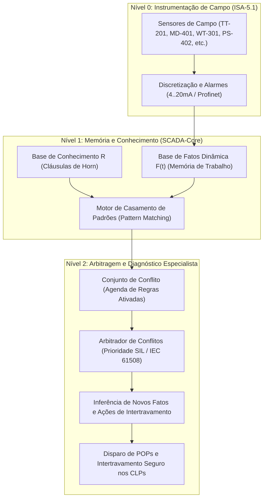

# Aula 08: Sistemas Especialistas — Base de Conhecimento e Regras de Diagnóstico da Fábrica de Paçoca

---

## 1. Fundamentos Matemáticos: Arquitetura de Sistemas Baseados em Regras (RBS)

Em linhas contínuas de manufatura agroalimentícia — como a planta de fabricação e embalagem automatizada de paçoca —, a ocorrência de distúrbios operacionais, variações na qualidade do amendoim ou falhas térmicas exige decisões de controle em frações de segundo. 

Para estruturar o raciocínio automatizado do motor supervisório do SCADA, emprega-se a teoria dos **Sistemas Especialistas Baseados em Regras** (*Rule-Based Expert Systems - RBS*).

Formalmente, um Sistema Baseado em Regras para o SCADA-Core é modelado pela tripla matemática:

$$\langle \mathcal{F}, \mathcal{R}, \mathcal{E} \rangle$$

Onde:
1. **$\mathcal{F}$ (Base de Fatos / Memória de Trabalho):** Conjunto finito e dinâmico de proposições discretizadas que representam a telemetria instantânea da planta no instante de varredura $t$:
   $$\mathcal{F}(t) = \{f_1, f_2, \dots, f_m\} \subseteq \mathcal{U}_{\text{fatos}}$$
2. **$\mathcal{R}$ (Base de Conhecimento / Regras de Produção):** Conjunto finito de sentenças lógicas formuladas estritamente em **Cláusulas de Horn Definidas** (*Definite Horn Clauses*):
   $$R_i: \quad \text{SE } \left(\bigwedge_{j=1}^{k} A_{i,j}\right) \quad \text{ENTÃO } \quad C_i$$
   Na álgebra proposicional clássica, cada regra equivale à disjunção com exatamente um literal positivo:
   $$R_i \equiv \left(\bigvee_{j=1}^{k} \neg A_{i,j}\right) \lor C_i$$
3. **$\mathcal{E}$ (Estratégia de Resolução de Conflitos e Arbitragem):** Algoritmo determinístico para seleção e escalonamento de regras ativadas simultaneamente no ciclo de varredura (*scan cycle*), considerando:
   - **Prioridade Normativa de Segurança (SIL / IEC 61508 / ISO 13849):** Proteções de vida humana e integridade patrimonial sobrepõem-se a regras de rendimento de batelada.
   - **Especificidade Lógica (*Specificity*):** Regras com maior número de antecedentes específicos têm precedência sobre regras genéricas.
   - **Tempo Crítico de Resposta ($t_{\text{max}}$):** Limite temporal determinístico de atuação do atuador de campo.

---

## 2. Vantagens Computacionais das Cláusulas de Horn em Sistemas Críticos

Na lógica matemática e complexidade computacional, o problema da satisfatibilidade booleana geral (**SAT**) é comprovadamente NP-Completo. Contudo, a restrição da Base de Conhecimento a **Cláusulas de Horn Definidas** confere propriedades fundamentais para sistemas de controle de tempo real:

1. **Raciocínio em Tempo Linear $O(N)$:**
   O casamento de padrões e a inferência dedutiva (*Forward Chaining*) possuem complexidade assintótica $O(n \cdot m)$, onde $n$ é o número de fatos e $m$ o número de regras, viabilizando ciclos determinísticos de varredura no SCADA (< 50 ms).
2. **Monotonicidade Lógica:**
   A adição de novos fatos verdadeiros nunca invalida conclusões deduzidas anteriormente no mesmo ciclo:
   $$\mathcal{F}_1 \subseteq \mathcal{F}_2 \implies \text{Ded}(\mathcal{F}_1 \cup \mathcal{R}) \subseteq \text{Ded}(\mathcal{F}_2 \cup \mathcal{R})$$
3. **Ausência de Ambiguidade:**
   Cada cláusula expressa uma implicação direta causal com um único consequente positivo ($C_i$).

---

## 3. Catálogo Especialista de Falhas da Fábrica de Paçoca (Grupo 7)

A Base de Conhecimento foi estruturada cobrindo os 4 setores de automação da planta (CLP 01 a CLP 04):

| ID Regra | Setor / CLP | Antecedentes ($\bigwedge A_{i,j}$) | Consequente ($C_i$) | Diagnóstico de Causa-Raiz | Severidade / Prioridade | Tempo Máx. | POP (Procedimento Operacional Padrão) |
| :---: | :---: | :--- | :--- | :--- | :---: | :---: | :--- |
| **R-01** | Setor 200 (CLP 02) | `TT-201_HIGH` $\land$ `TS-201_ON` | `RISCO_INCENDIO_TORRA` | **Sobreaquecimento Crítico no Forno de Torra** | **CRÍTICA** (Prio 10) | $0.5\text{ s}$ | `POP-TOR-01`: Cortar válvula de gás `XV-201`, manter exaustor `FS-201` no máximo e soar alarme `ALM-201`. |
| **R-02** | Setor 200 (CLP 02) | `TS-201_ON` $\land$ `M-201_OFF` | `ACUMULO_AMENDOIM_QUEIMA` | **Esteira do Forno Parada com Queimador Ativo** | **CRÍTICA** (Prio 10) | $0.5\text{ s}$ | `POP-TOR-02`: Desarmar queimador imediatamente e fechar válvula de corte rápido `XV-201`. |
| **R-03** | Setor 400 (CLP 04) | `MD-401_METAL` | `CONTAMINACAO_ALIMENTAR_METAL` | **Detecção de Fragmento Metálico na Linha de Paçoca** | **CRÍTICA** (Prio 10) | $0.2\text{ s}$ | `POP-SEG-01`: Parar esteira `M-401`, acionar sopro `XV-401`, rejeitar lote e sinalizar inspeção visual. |
| **R-04** | Setor 400 (CLP 04) | `PS-402_LOW` $\land$ `M-401_ON` | `FALHA_SISTEMA_REJEICAO` | **Pressão Pneumática Insuficiente para Sopro de Descarte** | **ALTA** (Prio 9) | $1.0\text{ s}$ | `POP-PNEUM-02`: Bloquear avanço da esteira `M-401` até recuperação da pressão nominal ($>6\text{ bar}$). |
| **R-05** | Setor 300 (CLP 03) | `WT-301_ERR` $\lor$ `WT-302_ERR` $\lor$ `WT-303_ERR` | `DESVIO_RECEITA_PACOCA` | **Desbalanceamento na Pesagem (Amendoim/Açúcar/Sal)** | **ALTA** (Prio 8) | $2.0\text{ s}$ | `POP-DOS-03`: Inibir abertura da válvula de descarga `XV-301` e desarmar motor do moinho `M-301`. |
| **R-06** | Setor 100 (CLP 01) | `MT-101_HIGH` $\lor$ `AT-101_HIGH` | `GRAO_DEGRADADO_REJEICAO` | **Umidade Excessiva ($>10\%$) ou Acidez Alta nos Grãos** | **ALTA** (Prio 8) | $3.0\text{ s}$ | `POP-REC-01`: Bloquear entrada do Silo 101 e desviar carga para secador auxiliar ou devolução. |
| **R-07** | Setor 400 (CLP 04) | `TT-401_LOW` $\land$ `SE-401_ON` | `FALHA_SELAGEM_EMBALAGEM` | **Subtemperatura na Barra Seladora Térmica** | **MÉDIA** (Prio 6) | $2.0\text{ s}$ | `POP-EMB-04`: Desviar doces para buffer intermediário e suspender selagem automática. |
| **R-08** | Setor 300 (CLP 03) | `M-301_CURRENT_HIGH` $\land$ `LT-301_LOW` | `TRAVAMENTO_MECANICO_MOINHO` | **Sobrecarga de Corrente no Moinho sem Carga de Amendoim** | **ALTA** (Prio 8) | $1.0\text{ s}$ | `POP-MAN-05`: Desligar moinho `M-301` e solicitar intervenção mecânica imediata. |

---

## 4. Métodos Formais de Auditoria e Consistência da Base de Regras

Para certificar que a base de regras é confiável e matematicamente consistente, o SCADA-Core realiza três testes formais de integridade:

### 4.1. Verificação de Não-Contradição (Consistência Lógica)
Não podem existir duas regras $R_a$ e $R_b$ com conjuntos equivalentes de antecedentes que deduzam conclusões antagônicas:
$$\nexists R_a, R_b \in \mathcal{R} \quad \text{tal que} \quad \text{Ant}(R_a) \equiv \text{Ant}(R_b) \quad \text{e} \quad \text{Cons}(R_a) = \neg \text{Cons}(R_b)$$

### 4.2. Detecção de Redundância e Subsunção
Se uma regra $R_a$ possui antecedentes que são um superconjunto de $R_b$ com o mesmo consequente, $R_a$ é redundante (subsumida):
$$\text{Se } \text{Ant}(R_b) \subset \text{Ant}(R_a) \quad \text{e} \quad \text{Cons}(R_a) = \text{Cons}(R_b) \implies R_a \text{ é redundante}$$

### 4.3. Indexação em Tabela Hash ($O(1)$)
Para garantir execução em tempo real, a Base de Conhecimento mantém um índice reverso $\mathcal{I}: \text{Fato} \rightarrow \mathcal{P}(\mathcal{R})$, permitindo ao motor de inferência recuperar instantaneamente apenas as regras afetadas pelos sensores que sofreram alteração no ciclo de scan.

---
