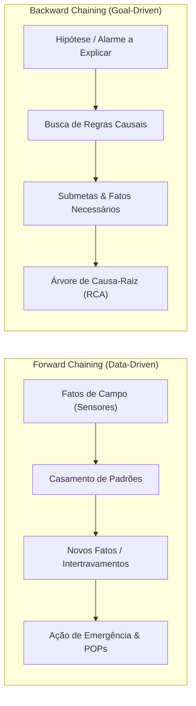
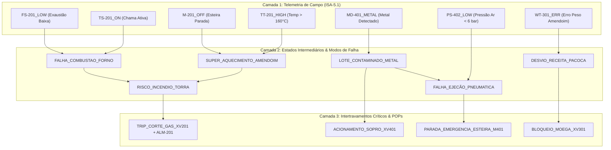

# Aula 09: Motor de Inferência — Algoritmos Forward e Backward Chaining Integrados ao SCADA-Core

---

## 1. Fundamentos Matemáticos: Teoria dos Motores de Inferência Dedutiva

Em sistemas especialistas aplicados a plantas agroindustriais contínuas — como a fábrica de paçoca do Grupo 7 —, o **Motor de Inferência** (*Inference Engine*) constitui o cérebro algorítmico do SCADA-Core. Sua função é aplicar regras de inferência lógica da matemática discreta (primordialmente o **Modus Ponens**) sobre a **Base de Fatos** da telemetria de campo para deduzir diagnósticos de falha, intertravamentos de segurança e procedimentos operacionais padrão (POPs).

Formalmente, dada uma Base de Fatos $\mathcal{F}$ e uma Base de Conhecimento $\mathcal{R}$ formulada em Cláusulas de Horn Definidas ($A_1 \land \dots \land A_k \rightarrow C$), existem duas estratégias fundamentais de raciocínio automatizado:

---

### 1.1. Encadeamento para Frente (*Forward Chaining* — Raciocínio Guiado por Dados)

- **Conceito Matemático:** Parte dos fatos observados $\mathcal{F}_0$ (sinais discretizados dos sensores ISA-5.1) e dispara sucessivas regras de produção cujos antecedentes estejam satisfeitos, adicionando os consequentes deduzidos à memória de trabalho até atingir um **ponto fixo** (*fixed point*): $\mathcal{F}_{k+1} = \mathcal{F}_k \cup \{C_i \mid (A_{i,1} \wedge \dots \wedge A_{i,m} \rightarrow C_i) \in \mathcal{R} \wedge \{A_{i,1}, \dots, A_{i,m}\} \subseteq \mathcal{F}_k\}$
- **Propriedades:**
  - **Monotônico e Convergente:** O operador de inferência $T_{\mathcal{R}}(\mathcal{F})$ é monótono crescente, garantindo convergência finita no menor modelo de Herbrand pelo Teorema do Ponto Fixo de Knaster-Tarski.
  - **Complexidade:** $O(N \cdot M)$ para $N$ fatos e $M$ regras com indexação em tabela hash.
---

### 1.2. Encadeamento para Trás (*Backward Chaining* — Raciocínio Guiado por Metas)

* **Conceito Matemático:** Parte de uma **meta de diagnóstico** ou hipótese de falha $G$ (ex: `"Por que o Forno de Torra desarmou?"`) e realiza uma busca recursiva em profundidade (DFS) na base de regras, verificando se os antecedentes necessários estão presentes na base de fatos ou se podem ser provados por outras regras intermediárias:
  $$\text{Provar}(G) \iff G \in \mathcal{F} \quad \lor \quad \exists (A_1 \land \dots \land A_k \rightarrow G) \in \mathcal{R} \text{ tal que } \forall j \in \{1,\dots,k\}, \text{Provar}(A_j)$$
* **Propriedades:**
  - **Construção de Árvores de Prova AND/OR:** Permite derivar a árvore de causa-raiz exata (*Root Cause Analysis - RCA*).
  - **Prevenção de Ciclos:** Mantém um conjunto de metas ativas na pilha de recursão para evitar loops infinitos em regras circulares.
* **Aplicação na Automação:** **Diagnóstico Post-Mortem de Falhas e Explicação ao Operador**. Quando o operador clica em um alarme na IHM do SCADA, o motor executa backward chaining e explica a sequência causal de eventos que provocou a parada.

---

### 1.3. Comparativo Arquitetural no SCADA-Core

| Característica | Forward Chaining (Data-Driven) | Backward Chaining (Goal-Driven) |
| :--- | :--- | :--- |
| **Gatilho Inicial** | Amostragem de sensores nos barramentos | Pergunta/Hipótese do operador ou alarme na IHM |
| **Direção do Fluxo** | Dados de Entrada $\rightarrow$ Conclusões Finais | Hipótese Final $\rightarrow$ Sinais Primários de Campo |
| **Tempo de Execução** | Ultrarrápido e determinístico ($< 2\text{ ms}$) | Sob demanda (investigativo) |
| **Função no SCADA** | **Intertravamento e Trip Automático** | **Diagnóstico de Causa-Raiz (RCA) e POP** |
| **Rastreabilidade** | Trilha linear de disparos (*Agenda Trail*) | Árvore hierárquica de prova (*Proof Tree*) |

---

## 2. Base de Conhecimento Hierárquica em 3 Camadas (Fábrica de Paçoca)

Para permitir cadeias dedutivas profundas (*multi-hop reasoning*), a Base de Regras do Grupo 7 foi estruturada em três camadas causais:

---

## 3. Catálogo Especialista de Regras em Cláusulas de Horn

| ID Regra | Antecedentes ($\bigwedge A_{i,j}$) | Consequente ($C_i$) | Nível de Severidade | Ação no SCADA / Procedimento (POP) |
| :---: | :--- | :--- | :---: | :--- |
| **R-101** | `TT-201_HIGH` $\land$ `M-201_OFF` | `SUPER_AQUECIMENTO_AMENDOIM` | ALTA | Estado térmico crítico derivado |
| **R-102** | `TS-201_ON` $\land$ `FS-201_LOW` | `FALHA_COMBUSTAO_FORNO` | ALTA | Risco de acúmulo de gases no forno |
| **R-103** | `SUPER_AQUECIMENTO_AMENDOIM` $\lor$ `FALHA_COMBUSTAO_FORNO` | `RISCO_INCENDIO_TORRA` | **CRÍTICA** (Prio 10) | Declaração de risco iminente de fogo |
| **R-104** | `RISCO_INCENDIO_TORRA` | `TRIP_CORTE_GAS_XV201` | **CRÍTICA** (Prio 10) | `POP-TOR-01`: Cortar `XV-201`, exaustão máx, soar `ALM-201` |
| **R-201** | `MD-401_METAL` | `LOTE_CONTAMINADO_METAL` | **CRÍTICA** (Prio 10) | Violação de segurança alimentar |
| **R-202** | `LOTE_CONTAMINADO_METAL` $\land$ `PS-402_OK` | `ACIONAMENTO_SOPRO_XV401` | ALTA (Prio 8) | `POP-REJ-01`: Ejeção automática pelo bico de sopro |
| **R-203** | `LOTE_CONTAMINADO_METAL` $\land$ `PS-402_LOW` | `FALHA_EJECAO_PNEUMATICA` | **CRÍTICA** (Prio 10) | Ejeção falhou por falta de pressão de ar |
| **R-204** | `FALHA_EJECAO_PNEUMATICA` | `PARADA_EMERGENCIA_ESTEIRA_M401` | **CRÍTICA** (Prio 10) | `POP-SEG-01`: Parar esteira `M-401` para impedir expedição |
| **R-301** | `WT-301_ERR` $\lor$ `WT-302_ERR` $\lor$ `WT-303_ERR` | `DESVIO_RECEITA_PACOCA` | ALTA (Prio 8) | Falha na dosagem de amendoim/açúcar/sal |
| **R-302** | `DESVIO_RECEITA_PACOCA` | `BLOQUEIO_MOEGA_XV301` | ALTA (Prio 8) | `POP-DOS-03`: Inibir descarga da moega e parar moinho `M-301` |
| **R-401** | `MT-101_HIGH` $\lor$ `AT-101_HIGH` | `GRAO_DEGRADADO_REJEICAO` | ALTA (Prio 8) | `POP-REC-01`: Bloquear entrada do Silo 101 |

---

