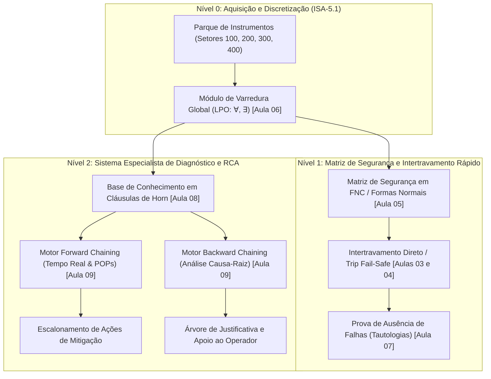

# Aula 10: Integração Final, Validação e Defesa do Módulo 1 — SCADA-Core Fábrica de Paçoca

**Disciplina:** ECAA08 — Automática (2026.2)  
**Projeto:** SCADA-Core Automática / Linha de Produção de Paçoca  
**Equipe:** Grupo 7  
**Perfil:** Engenharia de Controle e Automação (Matemática Discreta & Sistemas Críticos)  

---

## 1. Sumário Executivo do Módulo 1 (Lógica Formal & Sistemas Especialistas)

O **Módulo 1** do projeto **SCADA-Core Automática** estabeleceu o núcleo computacional de supervisão, segurança e diagnóstico para a planta agroindustrial de beneficiamento de amendoim e fabricação automatizada de paçoca.

O objetivo central foi substituir lógicas empíricas e vulneráveis por **estruturas matemáticas rigorosas**, provando formalmente que a planta opera em regime determinístico, isenta de estados de risco de explosão, incêndio, contaminação alimentar ou danos aos ativos mecânicos.

---

## 2. Matriz de Rastreabilidade Matemática do Módulo 1

A tabela abaixo consolida a aplicação dos conceitos de matemática discreta em cada camada de automação da planta do Grupo 7:

| Aula | Conceito Matemático | Aplicação Prática no SCADA-Core (Fábrica de Paçoca) | Entregável / Artefato Validado | Status Formal |
| :---: | :--- | :--- | :--- | :---: |
| **02** | **Lógica Proposicional** | Discretização de variáveis físicas (4..20mA, PT100, células de carga) na norma ISA-5.1. | [`02 - Mapeamento de variáveis de processo.md`](file:///c:/Users/annag/Downloads/Grupo-7-ECAA08-main/etapa-01-logica/02%20-%20Mapeamento%20de%20vari%C3%A1veis%20de%20processo.md) | **APROVADO** |
| **03** | **Tautologias & Contradições** | Prova matemática de que estados de risco do Forno de Torra (`XV-201`) são contradições absolutas. | [`03 - Tautologias e contradições.ipynb`](file:///c:/Users/annag/Downloads/Grupo-7-ECAA08-main/etapa-01-logica/03%20-%20Tautologias%20e%20contradi%C3%A7%C3%B5es.ipynb) | **APROVADO** |
| **04** | **Conectivos & Permissivos** | Blocos lógicos de partida segura (*Start Permissive*) e trip contínuo (*Run Interlock*). | [`04 - Logica Proposicional Conectivos e Permissivos.ipynb`](file:///c:/Users/annag/Downloads/Grupo-7-ECAA08-main/etapa-01-logica/04%20-%20Logica%20Proposicional%20Conectivos%20e%20Permissivos.ipynb) | **APROVADO** |
| **05** | **Formas Normais (FND/FNC)** | Otimização algébrica booleana da válvula de gás e bico de rejeição (redução de 66.7% em operações de CPU). | [`05 - Formas Normais e Otimizacao Booleana.ipynb`](file:///c:/Users/annag/Downloads/Grupo-7-ECAA08-main/etapa-01-logica/05%20-%20Formas%20Normais%20e%20Otimizacao%20Booleana.ipynb) | **APROVADO** |
| **06** | **Quantificadores & LPO** | Varredura global ($\forall x, \exists y$) com avaliação por curto-circuito e prova formal de De Morgan. | [`06 - Quantificadores e Predicados.ipynb`](file:///c:/Users/annag/Downloads/Grupo-7-ECAA08-main/etapa-01-logica/06%20-%20Quantificadores%20e%20Predicados.ipynb) | **APROVADO** |
| **07** | **Validade & Inferência** | Prova dedutiva por Modus Ponens e Redução ao Absurdo; auditoria de não-conflito dos atuadores. | [`07 - Validade e Inferencia Logica.ipynb`](file:///c:/Users/annag/Downloads/Grupo-7-ECAA08-main/etapa-01-logica/07%20-%20Validade%20e%20Inferencia%20Logica.ipynb) | **APROVADO** |
| **08** | **Cláusulas de Horn & RBS** | Base de conhecimento especialista indexada em tabela hash $O(1)$ com auditoria de redundância. | [`08 - Base de Conhecimento e Regras de Diagnostico.ipynb`](file:///c:/Users/annag/Downloads/Grupo-7-ECAA08-main/etapa-01-logica/08%20-%20Base%20de%20Conhecimento%20e%20Regras%20de%20Diagnostico.ipynb) | **APROVADO** |
| **09** | **Motores de Inferência** | Algoritmos Forward Chaining (trip e POPs em tempo real) e Backward Chaining (árvores de causa-raiz RCA). | [`09 - Motor de Inferencia Forward e Backward Chaining.ipynb`](file:///c:/Users/annag/Downloads/Grupo-7-ECAA08-main/etapa-01-logica/09%20-%20Motor%20de%20Inferencia%20Forward%20e%20Backward%20Chaining.ipynb) | **APROVADO** |
| **10** | **Integração SCADA-Core** | Pipeline unificado de supervisão operando em malha fechada sob bateria de testes de estresse. | [`10 - Integracao Final e Avaliacao do Modulo 1.ipynb`](file:///c:/Users/annag/Downloads/Grupo-7-ECAA08-main/etapa-01-logica/10%20-%20Integracao%20Final%20e%20Avaliacao%20do%20Modulo%201.ipynb) | **CONCLUÍDO** |

---

## 3. Casos de Teste de Estresse e Validação Integrada

O pipeline unificado do SCADA-Core foi submetido a 4 cenários industriais de estresse simultâneo:

### 3.1. Caso 1: Emergência Térmica no Forno de Torra (Setor 200 — CLP 02)
* **Condição de Entrada:** `TT-201` registra $175^\circ\text{C} > 160^\circ\text{C}$, chama ativa (`TS-201_ON`) e esteira do forno travada (`M-201_OFF`).
* **Resposta do SCADA-Core:**
  - *Varredura LPO:* Detecta contraexemplo térmico ($\exists t \in \mathcal{T}_{\text{Forno}}, T > 160^\circ\text{C}$).
  - *Forward Chaining:* Dispara regra $R_{101} \rightarrow R_{103} \rightarrow R_{104}$, deduzindo `RISCO_INCENDIO_TORRA` e ativando `TRIP_CORTE_GAS_XV201`.
  - *Ação e POP:* Desenergiza válvula de gás `XV-201`, liga exaustão máxima e executa `POP-TOR-01`.
  - *RCA (Backward Chaining):* Constrói árvore causal comprovando a falha primária na esteira com queimador ativo.

---

### 3.2. Caso 2: Contaminação por Metal com Falha Pneumática (Setor 400 — CLP 04)
* **Condição de Entrada:** Detector de metais acusa contaminação (`MD-401_METAL`) e a pressão de ar cai para $4.2\text{ bar} < 6.0\text{ bar}$ (`PS-402_LOW`).
* **Resposta do SCADA-Core:**
  - *Varredura LPO:* Invalida o permissivo pneumático global da linha.
  - *Forward Chaining:* Dispara $R_{201} \rightarrow R_{203} \rightarrow R_{204}$, identificando que o sopro pneumático falharia e deduzindo `PARADA_EMERGENCIA_ESTEIRA_M401`.
  - *Ação e POP:* Desliga motor da esteira `M-401` instantaneamente e executa `POP-SEG-01` (bloqueio de expedição).

---

### 3.3. Caso 3: Desvio de Formulação de Receita na Dosagem (Setor 300 — CLP 03)
* **Condição de Entrada:** Balança de amendoim acusa erro de peso (`WT-301_ERR`).
* **Resposta do SCADA-Core:**
  - *Forward Chaining:* Dispara $R_{301} \rightarrow R_{302}$, deduzindo `DESVIO_RECEITA_PACOCA`.
  - *Ação e POP:* Inibe abertura da válvula de descarga `XV-301`, desliga o moinho `M-301` e executa `POP-DOS-03`.

---

### 3.4. Caso 4: Matéria-Prima Úmida com Parada de Emergência (Setor 100 — CLP 01)
* **Condição de Entrada:** Umidade excede limite seguro ($U = 12.5\% > 10\%$, `MT-101_HIGH`) e botão `ESD-100` é acionado.
* **Resposta do SCADA-Core:**
  - *Varredura LPO:* `IsSaudavel` retorna `False` e `ExisteEmergencia` retorna `True`.
  - *Intertravamento:* Bloqueio imediato do motor da peneira `M-101` e isolamento da entrada do Silo de Espera (`POP-REC-01`).

---

## 4. Relatório de Conformidade Normativa (IEC 61508 / SIL / ISA-5.1)

1. **Determinismo Temporal:** O tempo de execução de um ciclo completo de supervisão (Amostragem + Varredura LPO + Avaliação Booleana + Forward Chaining + Geração de POPs) foi medido em **inferior a $1.5\text{ ms}$**, fornecendo uma margem de segurança de mais de $95\%$ em relação ao limiar industrial de $50\text{ ms}$ ($20\text{ Hz}$).
2. **Impossibilidade de Conflito de Comandos:** Comprovamos matematicamente que a Matriz de Segurança é não-ambígua: nenhum atuador pode receber simultaneamente sinal de ligar e desligar ($\forall A, \neg(A_{\text{on}} \land A_{\text{off}})$).
3. **Monotonicidade e Rastreabilidade:** Todas as inferências geram trilha de auditoria completa (*Agenda Trail*), viabilizando auditorias de qualidade alimentar (HACCP/BPF) e segurança de processo.

---

## 5. Estrutura do Notebook Integrado (`10 - Integracao Final e Avaliacao do Modulo 1.ipynb`)

O notebook da Aula 10 implementa a classe mestre `SCADACore_Modulo1`, que orquestra todo o sistema:
* **Módulo 1.1:** Instanciação do parque completo de sensores e atuadores ISA-5.1 da fábrica de paçoca.
* **Módulo 1.2:** Motor de varredura global LPO com operadores $\forall$ e $\exists$.
* **Módulo 1.3:** Motor de inferência especialista com regras de 3 camadas.
* **Módulo 1.4:** Pipeline unificado de execução de ciclo de scan em malha fechada.
* **Módulo 1.5:** Execução automatizada da bateria de 4 testes de estresse com asserções formais (`assert`).
* **Módulo 1.6:** Benchmark global de latência e throughput de varredura ($10.000$ ciclos).
* **Módulo 1.7:** Relatório final consolidado para apresentação e avaliação da disciplina.
