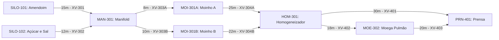

# Aula 11: Teoria dos Grafos — Modelagem de Tubulações e Instrumentos

**Disciplina:** ECAA08 — Automática (2026.2) — UNIFEI  
**Projeto:** SCADA-Core Automática / Linha de Produção de Paçoca  
**Equipe:** Grupo 7  
**Perfil:** Engenharia de Controle e Automação (Matemática Discreta & Teoria dos Grafos)  

---

## 1. Fundamentos Matemáticos: Definição Formal de Dígrafos Ponderados

Um **Grafo Dirigido e Ponderado (Dígrafo)** é formalmente definido pela tripla:
$$G = (V, E, W)$$

Onde:
1. **$V = \{v_1, v_2, \dots, v_n\}$** é o conjunto finito de **vértices (nós)**: silos de amendoim e açúcar, manifold de dosagem, moinhos de martelo, homogeneizador de massa, moega pulmão e prensa de compactação.
2. **$E \subseteq V \times V$** é o conjunto de **arestas dirigidas (arcos)** de tubulação com sentido de fluxo permitido (transporte pneumático, roscas transportadoras e esteiras).
3. **$W: E \rightarrow \mathbb{R}^+$** é a **função de ponderação**, que associa a cada duto um custo operacional (comprimento físico $L\text{ [m]}$ ou perda de carga $\Delta P$).

A leitura do diagrama acima é direta: cada seta representa um trecho físico de tubulação ou transporte de produto com sentido de escoamento fixo (definido por sopradores pneumáticos, roscas helicoidais ou gravidade), e o rótulo indica o comprimento em metros e a tag ISA-5.1 da válvula de bloqueio ou retenção instalada naquele trecho.

---

## 2. Por que um Grafo e não uma Lista de Equipamentos?

Uma linha de produção de alimentos pode, em princípio, ser descrita apenas por uma lista de equipamentos e uma lista de tubulações — e é exatamente assim que a maioria dos bancos de dados de engenharia (P&ID databases, *intools*, *SmartPlant*) armazena a informação. A diferença ao adotar a **estrutura de grafo** é que ela expõe propriedades topológicas que uma tabela simples esconde:

1. **Conectividade:** É possível provar formalmente se existe (ou não) um caminho de um silo de matéria-prima até a prensa de paçoca, sem inspecionar manualmente o P&ID.
2. **Redundância:** O grau de entrada do homogeneizador ($\deg^-(HOM\text{-}301) = 2$, alimentado por `MOI-301A` e `MOI-301B`) e o grau de saída do manifold ($\deg^+(MAN\text{-}301) = 2$) evidenciam a existência de moinhos redundantes em paralelo — uma propriedade de tolerância a falhas que fica implícita em uma tabela.
3. **Composição de algoritmos:** Uma vez que a planta é modelada como grafo, toda a teoria desenvolvida ao longo de séculos (Euler, 1736; Dijkstra, 1959; Hierholzer, 1873) torna-se aplicável sem reformulação — é isso que exploraremos nas Aulas 12 a 18.

---

### 2.1. Definições Fundamentais de Teoria dos Grafos

Para tornar o vocabulário preciso, formalizamos os conceitos que serão usados em toda a etapa:

* **Ordem** do grafo: $|V| = n$, o número de vértices (equipamentos e instrumentos). Na nossa planta nuclear, $|V| = 8$.
* **Tamanho** do grafo: $|E| = m$, o número de arestas (trechos de tubulação e transporte). Na nossa planta, $|E| = 9$.
* **Passeio (*walk*):** sequência alternada $v_0, e_1, v_1, e_2, \dots, e_k, v_k$ onde cada $e_i = (v_{i-1}, v_i) \in E$. Representa fisicamente o percurso de uma porção de amendoim ou açúcar, podendo repetir tubulações.
* **Caminho (*path*):** um passeio sem vértices repetidos. É o objeto de interesse quando queremos saber *a rota* de um ingrediente entre dois pontos, sem retrocessos.
* **Trilha (*trail*):** um passeio sem arestas repetidas (mas vértices podem se repetir). Relevante na Aula 16, quando o robô de inspeção pode passar duas vezes pelo mesmo manifold, mas nunca inspeciona o mesmo trecho de duto duas vezes.
* **Ciclo (*cycle*):** um caminho fechado ($v_0 = v_k$) com $k \geq 1$ arestas e sem repetição de vértices intermediários. A existência de ciclos no grafo de tubulação indica **rotas alternativas de contingência ou reciclo de finos**, tema central da Aula 15.
* **Grau de saída** $\deg^+(v)$: número de arestas que partem de $v$ (dutos que descarregam de $v$).
* **Grau de entrada** $\deg^-(v)$: número de arestas que chegam a $v$ (dutos que alimentam $v$).

---

### 2.2. Lema do Aperto de Mãos Dirigido

Para qualquer dígrafo $G = (V, E)$:

$$\sum_{v \in V} \deg^+(v) = \sum_{v \in V} \deg^-(v) = |E|$$

**Justificativa:** cada aresta contribui exatamente $+1$ para o grau de saída de sua origem e $+1$ para o grau de entrada de seu destino — nunca mais, nunca menos. Essa identidade é a base da verificação de consistência de qualquer P&ID digitalizado: se a soma dos graus de saída não bater com o número de tubulações cadastradas, há um erro de modelagem (duto duplicado, órfão ou com origem/destino trocados).

**Verificação na rede do notebook:** a tabela de graus topológicos calculada na Aula 11 mostra 9 tubulações. Somando a coluna `deg+`: $1+1+2+1+1+2+1+0 = 9$. Somando `deg-`: $0+0+2+1+1+2+1+2=9$. A identidade se confirma.

---

### 2.3. Representações Computacionais e Trade-offs

| Representação | Estrutura | Custo de espaço | Consulta "existe aresta $(u,v)$?" | Quando usar |
| --- | --- | --- | --- | --- |
| Matriz de adjacência | `float[n][n]` | $O(n^2)$ | $O(1)$ | Grafos densos ou quando se precisa de álgebra matricial (Aula 12) |
| Lista de adjacência | `dict[str, list]` | $O(n + m)$ | $O(\deg(u))$ | Grafos esparsos — típico em plantas reais, onde $m \approx n$ a $2n$ |
| Matriz de incidência | `int[n][m]` | $O(n \cdot m)$ | — (usada para balanço, não busca) | Balanço de massa e análise de ciclos (Aula 12) |

A classe `GrafoTubulacao` implementada no notebook desta aula adota a **matriz de adjacência dupla**: uma matriz binária (`adj_binaria`, para existência de conexão) e uma matriz de pesos (`adj_pesos`, inicializada com $\infty$ fora da diagonal e $0$ na diagonal — a convenção padrão para algoritmos de caminho mínimo, pois $\infty$ representa "sem rota direta" e $0$ representa "custo de ficar no mesmo nó").

---

### 2.4. Grafo Simples vs. Multigrafo

Um detalhe frequentemente negligenciado: se dois equipamentos são conectados por **duas tubulações paralelas** (comum em sistemas críticos, como transporte pneumático duplo de amendoim por redundância), o modelo deixa de ser um grafo simples e passa a ser um **multigrafo**, pois existe mais de uma aresta entre o mesmo par ordenado de vértices. A implementação com matriz de adjacência simples (como a do notebook) não captura essa redundância diretamente — seria necessário armazenar uma lista de pesos por par $(u,v)$ ao invés de um escalar. Isso é retomado como exercício.

---

## 3. Exemplo Resolvido

**Pergunta:** Qual é o grau de saída total da rede e o que ele representa fisicamente?

**Resolução:** Some a coluna `deg+` da tabela topológica:

$$\begin{aligned}
\sum_{v \in V} \deg^+(v) &= \deg^+(\text{SILO-101}) + \deg^+(\text{SILO-102}) + \deg^+(\text{MAN-301}) + \deg^+(\text{MOI-301A}) \\
&\quad + \deg^+(\text{MOI-301B}) + \deg^+(\text{HOM-301}) + \deg^+(\text{MOE-302}) + \deg^+(\text{PRN-401}) \\
&= 1 + 1 + 2 + 1 + 1 + 2 + 1 + 0 = \mathbf{9}
\end{aligned}$$

Fisicamente, esse total representa o número de válvulas de bloqueio de saída instaladas na malha — uma informação diretamente utilizável na lista de instrumentação (*instrument index*) da planta.

---

## 4. Atividades de Investigação

1. Prove, a partir do Lema do Aperto de Mãos Dirigido, que é impossível existir um dígrafo com exatamente um vértice de grau de saída ímpar e todos os demais com grau de saída par, se a soma dos graus de entrada for par.
2. Adicione uma tubulação redundante `SILO-101_Amendoim -> MAN-301_Dosagem` (uma segunda linha física) e discuta por que a matriz de adjacência binária simples não representa corretamente essa redundância. Proponha uma estrutura de dados alternativa.
3. Classifique cada um dos 9 trechos da rede padrão como pertencente a um caminho, uma trilha ou nenhum dos dois, considerando a rota completa de `SILO-101_Amendoim` até `PRN-401_Prensa` passando por `MOE-302_Pulmao`.
4. Se a prensa `PRN-401_Prensa` tivesse uma saída de retorno para `HOM-301_Massa` (reprocessamento de finos e quebras de paçoca), quantos ciclos simples passariam a existir na rede? Enumere-os.

---

## 5. Entregável da Aula 11

* **Classe `GrafoTubulacao` em Python:** Estrutura orientada a objetos com suporte a nós ISA-5.1, inserção de tubulações com peso e válvula associada, e exportação das matrizes de adjacência.
