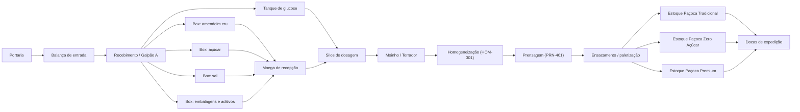
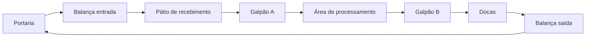

# Aula 18: Grafos de Logística de Insumos, Processo e Produtos Acabados — Linha de Paçoca

**Disciplina:** ECAA08 — Automática (2026.2) — UNIFEI  
**Projeto:** SCADA-Core Automática / Linha de Produção de Paçoca  
**Equipe:** Grupo 7  
**Perfil:** Engenharia de Controle e Automação (Matemática Discreta & Teoria dos Grafos)  

---

## 1. Situação-problema

Nas aulas anteriores, a planta foi representada principalmente pela malha de processo: silos de amendoim e açúcar, manifold de dosagem, moinhos, homogeneizador e prensa (Aulas 11 a 15), além da malha de inspeção (Aula 16) e do roteamento do AGV de amostragem (Aula 17). A operação industrial completa também exige decidir **como os insumos chegam ao processo** e **como o produto acabado (a paçoca embalada) alcança a expedição**.

O layout logístico da fábrica considera, entre outros elementos:

* portaria e balança de entrada;
* Galpão A, com boxes de amendoim cru, açúcar, sal, embalagens/aditivos e um tanque de glucose (xarope ligante usado na formulação);
* moega de recepção, silos de dosagem, moinho/torrador, homogeneizador e prensa;
* ensacamento/paletização e os estoques de Paçoca Tradicional, Paçoca Zero Açúcar e Paçoca Premium no Galpão B;
* docas de carregamento e balança de saída.

O objetivo desta aula é construir grafos que conectem esses setores logísticos ao processo físico de fabricação de paçoca descrito nas Aulas 11 a 15, sem confundir fluxos fisicamente diferentes.

---

## 2. Fundamentos Teóricos: Redes Multicamada e Grafos Acíclicos Dirigidos

### 2.1. Por que a Cadeia Logística é um DAG

Diferente da malha de tubulação das Aulas 11-15 (que contém ciclos de contingência, como as rotas paralelas via `MOI-301A`/`MOI-301B` e o desvio `HOM-301 -> MOE-302 -> PRN-401`), o fluxo de materiais $G_M$ desta aula — do recebimento até a expedição — é, por definição de processo, um **Grafo Acíclico Dirigido (DAG — *Directed Acyclic Graph*)**: não existe caminho que retorne a um vértice já visitado, pois cada etapa de transformação (dosagem, torra, moagem, homogeneização, prensagem, ensaque) é irreversível dentro do fluxo normal de produção de paçoca.

**Definição formal:** um dígrafo $G=(V,E)$ é um DAG se não existe nenhum ciclo dirigido, ou seja, não existe sequência $v_0, v_1, \dots, v_k = v_0$ com $(v_{i-1}, v_i) \in E$ para todo $i$.

**Propriedade fundamental (ordenação topológica):** todo DAG admite pelo menos uma **ordenação topológica**, isto é, uma numeração dos vértices $\text{ord}: V \rightarrow \{1, \dots, n\}$ tal que, para toda aresta $(u,v) \in E$, $\text{ord}(u) < \text{ord}(v)$. Essa propriedade é o que torna o grafo de processo auditável: qualquer sequência de produção pode ser verificada como fisicamente possível apenas checando se ela respeita a ordenação topológica do DAG — por exemplo, o modelo não permite que `Ensacamento / paletização` ocorra antes de `Prensagem (PRN-401)`, porque não existe nenhuma ordenação topológica compatível com essa inversão.

**Algoritmo de Kahn (1962):** calcula uma ordenação topológica em $O(|V|+|E|)$ processando repetidamente vértices de grau de entrada zero, removendo-os do grafo (e decrementando o grau de entrada de seus sucessores) até que todos os vértices tenham sido processados. Se, ao final, restarem vértices com grau de entrada positivo, o grafo **não** é um DAG — um teste direto e eficiente de aciclicidade, complementar à análise de arestas de retorno via DFS vista na Aula 13.

### 2.2. Redes Multicamada (*Multilayer Networks*)

A estratégia adotada de modelar **dois grafos distintos** ($G_M$ e $G_V$) sobre a mesma planta física é um caso particular do que a literatura de ciência de redes chama de **rede multicamada**: um mesmo conjunto (ou conjuntos sobrepostos) de entidades físicas é representado por múltiplas camadas de conexão, cada uma correspondendo a um tipo diferente de relação. Formalmente, uma rede multicamada é uma tupla $\mathcal{M} = (\{G_\alpha\}_{\alpha \in L}, \{V_\alpha\}, \{E_{\alpha\beta}\})$, onde $L$ é o conjunto de camadas (aqui, `materiais` e `veículos`) e $E_{\alpha\beta}$ pode incluir arestas de acoplamento entre camadas (por exemplo, ligando o vértice `Galpão A` de $G_V$ ao vértice `Recebimento / Galpão A` de $G_M$, pois fisicamente é o mesmo espaço).

O motivo de **não colapsar tudo em um único grafo** é evitar um erro clássico de modelagem: aplicar um algoritmo de uma camada (como Dijkstra sobre $G_M$) para responder uma pergunta que pertence a outra camada (como a rota de circulação de uma empilhadeira ou caminhão em $G_V$). Vértices com o mesmo nome textual em camadas diferentes (`Galpão A`, por exemplo) **não são o mesmo vértice do grafo** — são representações de um mesmo espaço físico sob óticas distintas (fluxo de material vs. circulação de veículo), e misturar as arestas das duas camadas produziria rotas fisicamente inválidas.

### 2.3. Cadeia de Suprimentos como Composição de Grafos

Uma cadeia de suprimentos completa (*supply chain*) da fábrica de paçoca pode ser vista como a composição de subgrafos menores, cada um estudável com as ferramentas já vistas nesta etapa:

| Subproblema da cadeia | Ferramenta da Etapa 02 aplicável |
| --- | --- |
| Menor rota entre um box de insumo (amendoim, açúcar, sal) e a expedição | Dijkstra (Aula 14 / esta aula) |
| Verificar se existe rota alternativa em caso de bloqueio de um trecho da moagem | Reponderação dinâmica (Aula 15) |
| Rota do AGV que visita múltiplos pontos de amostragem e retorna ao laboratório | TSP com heurística NN + 2-Opt (Aula 17) |
| Auditar se a sequência de produção respeita a ordem física do processo (não ensacar antes de prensar) | Ordenação topológica de DAG (Seção 2.1 desta aula) |
| Verificar a robustez da linha a uma única falha de trecho | Detecção de pontes / isolamento de trecho (Aula 15) |

Essa tabela evidencia o objetivo pedagógico da Etapa 02 como um todo: os mesmos poucos algoritmos fundamentais (BFS, DFS, Dijkstra, Hierholzer, heurísticas de TSP) se recombinam para responder a praticamente todas as perguntas operacionais da fábrica de paçoca do Grupo 7 — da tubulação interna à logística externa de insumos e produto acabado.

### 2.4. Limitações do Modelo com Peso Único

Os grafos $G_M$ e $G_V$ implementados nesta aula usam um único escalar de peso (distância estimada). Em uma modelagem mais completa, cada aresta poderia carregar um **vetor de custos** $\vec{w}(u,v) = (\text{distância}, \text{tempo}, \text{custo monetário}, \text{risco de contaminação cruzada})$, transformando o problema de menor caminho em um **problema de otimização multiobjetivo**, que não possui, em geral, uma única "melhor" rota, mas sim uma **fronteira de Pareto** de soluções não-dominadas. Esse tópico avançado é mencionado aqui como direção de aprofundamento, mas foge do escopo desta etapa introdutória.

---

## 3. Dois grafos para o mesmo layout

Um único grafo não expressa adequadamente todas as regras da fábrica de paçoca. Modelaremos duas redes.

| Grafo | Vértices | Arestas dirigidas | Peso | Pergunta respondida |
| --- | --- | --- | --- | --- |
| $G_M$ — fluxo de materiais | setores, equipamentos e estoques | transferência permitida de material | distância interna estimada (m) | Como um insumo (amendoim, açúcar, sal, glucose) chega à doca como paçoca embalada? |
| $G_V$ — circulação de veículos | portaria, balanças, pátios, galpões e docas | trechos autorizados para caminhão/empilhadeira | distância de circulação estimada (m) | Qual rota interna o veículo pode percorrer? |

O notebook desta aula implementa $G_M$ e $G_V$. A mesma estrutura pode receber custos monetários, tempo, emissões ou risco, desde que todos os pesos de uma consulta representem a mesma grandeza.

---

## 4. Grafo dirigido do fluxo de materiais

Definimos:

$$G_M=(V_M,E_M,w_M), \qquad w_M:E_M\rightarrow\mathbb{R}_{\geq0}.$$

O conjunto de vértices inclui os pontos do layout logístico da fábrica de paçoca:

As arestas de `Portaria` até `Recebimento / Galpão A` representam a liberação e a entrada física do caminhão de insumos. A partir do recebimento, as arestas representam a disponibilidade do insumo para a transferência interna. Assim, uma rota no grafo é uma **rota operacional de referência**, e não uma alegação de que o mesmo caminhão percorre todas as etapas de fabricação da paçoca.

### 4.1. Correspondência com os insumos da linha de produção

| Insumo | Vértice de recebimento | Uso no modelo |
| --- | --- | --- |
| Amendoim cru | `Box: amendoim cru` | alimentação sólida da moega, segue para torra/moagem |
| Açúcar | `Box: açúcar` | alimentação sólida da moega, formulação da massa |
| Sal | `Box: sal` | alimentação sólida da moega, ajuste de sabor |
| Embalagens e aditivos (papel, filme, essências) | `Box: embalagens e aditivos` | consumidos majoritariamente no ensacamento, mas modelados no fluxo de recepção |
| Glucose / xarope ligante | `Tanque de glucose` | alimentação direta dos silos de dosagem, aglutinante da massa |

Os produtos Paçoca Tradicional, Paçoca Zero Açúcar e Paçoca Premium aparecem como vértices distintos para preservar a rastreabilidade da alocação após o ensacamento/paletização — essencial em uma linha de alimentos, onde cada lote precisa manter rastreabilidade de formulação até a expedição.

---

## 5. Grafo de circulação de veículos

O fluxo de materiais é dirigido: não se deve retornar produto acabado ao moinho sem uma regra específica de retrabalho (reprocessamento de finos ou quebras de paçoca, tema abordado nas atividades da Aula 12). Já o anel viário do layout pode ter trechos bidirecionais ou de sentido único. Para cada sentido permitido, inclua uma aresta em $G_V$.

Essa separação impede um erro comum: aplicar Dijkstra sobre o fluxo de materiais para decidir por onde um caminhão ou empilhadeira deve circular dentro da fábrica de paçoca. Os vértices podem ter nomes semelhantes, mas o conjunto de arestas e as restrições são diferentes.

### 5.1. O Anel Viário como Ciclo Hamiltoniano Degenerado

Vale notar que $G_V$, ao contrário de $G_M$, **contém um ciclo dirigido** por construção: `Portaria -> ... -> Docas -> Balança de saída -> Portaria`. Esse ciclo não é uma falha de modelagem — reflete o fato de que o mesmo veículo entra e sai da planta pelo mesmo ponto de controle (a portaria), fechando o percurso. Trata-se de um caso particular (e simplificado) de Ciclo Hamiltoniano, no sentido da Aula 17: se a fábrica tivesse múltiplos pontos de coleta de amostras a serem visitados em uma única viagem — exatamente o cenário do AGV de controle de qualidade —, o problema de definir a melhor ordem de visita se reduziria ao TSP estudado naquela aula, com a heurística NN + 2-Opt aplicável diretamente.

---

## 6. Exemplo Resolvido

**Pergunta:** Por que a rota de menor custo de `Portaria` até `Docas de expedição` em $G_M$ passa por `Tanque de glucose` no lugar de qualquer um dos boxes sólidos (amendoim cru, açúcar, sal, embalagens), como reportado pelo notebook?

**Resolução:** Isso decorre diretamente dos pesos atribuídos às arestas de recebimento: `Recebimento / Galpão A -> Tanque de glucose` tem peso $28$, enquanto os boxes sólidos têm pesos entre $18$ e $25$; entretanto, a etapa seguinte de `Tanque de glucose -> Silos de dosagem` (peso $45$) é mais curta que o caminho equivalente pelos boxes sólidos, que precisam primeiro passar pela `Moega de recepção` (peso adicional de $30$ a $38$) antes de alcançar os `Silos de dosagem` (mais $40$). Somando os dois trechos, a rota via glucose ($28+45=73$) é mais curta que qualquer rota via um box sólido (por exemplo, via sal: $22+30+40=92$). Esse resultado ilustra por que o algoritmo de Dijkstra deve sempre considerar a **soma acumulada** do caminho, e não apenas o peso do primeiro trecho — um erro comum de interpretação para quem está aprendendo o algoritmo.

O caminho completo `Portaria -> Balança de entrada -> Recebimento / Galpão A -> Tanque de glucose -> Silos de dosagem -> Moinho / Torrador -> Homogeneização (HOM-301) -> Prensagem (PRN-401) -> Ensacamento / paletização -> Estoque Paçoca Tradicional -> Docas de expedição` totaliza $334\,\text{m}$, conforme calculado pelo notebook.

---

## 7. Atividades de investigação

1. Execute o notebook e identifique o caminho mínimo de `Portaria` até cada um dos três estoques de produto acabado (`Estoque Paçoca Tradicional`, `Estoque Paçoca Zero Açúcar`, `Estoque Paçoca Premium`) em $G_M$.
2. Remova temporariamente a aresta `Ensacamento / paletização -> Estoque Paçoca Zero Açúcar`. O que o algoritmo informa? Relacione o resultado a uma indisponibilidade de área de armazenagem.
3. No $G_V$, altere uma via de mão dupla para mão única e verifique se ainda existe ciclo `Portaria -> ... -> Portaria`.
4. Substitua os pesos em metros por tempo médio (minutos). Explique por que uma rota mais curta em metros pode deixar de ser a melhor rota logística.
5. Inclua um vértice `Área de quarentena` entre o recebimento do amendoim e a moega, exigido por controle de qualidade (verificação de aflatoxinas). Que regra deve liberar a nova aresta?
6. Aplique o Algoritmo de Kahn (Seção 2.1) sobre $G_M$ e confirme que a ordenação topológica obtida respeita a sequência física de fabricação da paçoca (recepção antes de dosagem, dosagem antes de torra/moagem, moagem antes de homogeneização, homogeneização antes de prensagem, prensagem antes de ensacamento).

---

## 8. Entregável da Aula 18

* **Modelo `GrafoLogistico` em Python:** criação de rotas dirigidas e ponderadas, cálculo do menor caminho por Dijkstra e validação de uma rota de recebimento até a expedição, aplicado à Fábrica de Paçoca do Grupo 7.
* **Dois modelos coerentes:** uma rede para fluxo de materiais ($G_M$) e outra para circulação interna de veículos ($G_V$), ambas baseadas nos setores da linha de produção de paçoca (recepção de amendoim, açúcar, sal e glucose; torra/moagem; homogeneização; prensagem; ensacamento; e expedição dos três produtos finais).
